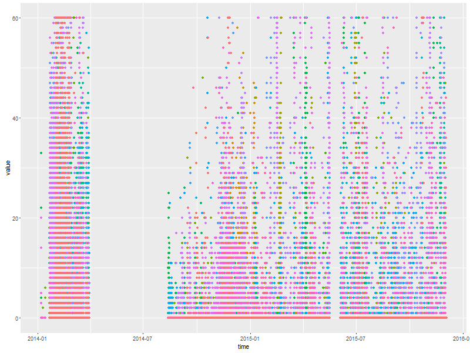

# vitens
==========
*Vitens Data Challenge*

Vitens approached the market for looking into part of their data on their water distribution network (available on request from Vitens). We used these R scripts to sort, visualize and analyse the 5GB dataset using full parallel processing and state-of-art R techniques.

---------

---------

---------

---------

---------

